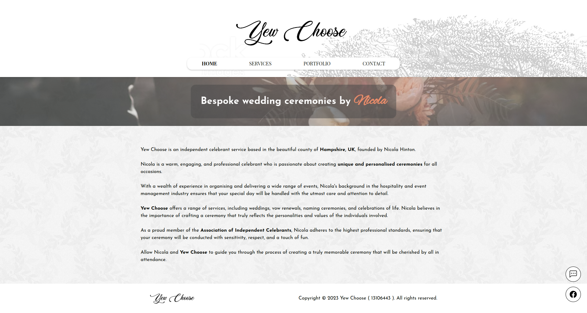

# Yew Choose
Yew Choose is a React-based website for a wedding celebrant, designed to showcase their services and portfolio in a beautiful and engaging way. The website features a responsive layout, a hero section with a video background, a portfolio section with a customizable image gallery, and a call-to-action section with a booking form. Created for my Mum's wedding celebrant business, Yew Choose.

## Technologies
React
SCSS
React Image Gallery

## Screenshots
<!-- docs/home.png -->

## Usage
To run the project locally, you can follow these steps:

Clone this repository: `git clone https://github.com/james-hinton/yew-choose.git`

Install the dependencies: `npm install`

Start the development server: `npm start`

Open the website in your browser at `http://localhost:3000`

## Contributing
Pull requests are welcome. For major changes, please open an issue first to discuss what you would like to change.

## License
This project is licensed under the MIT License - see the LICENSE file for details
